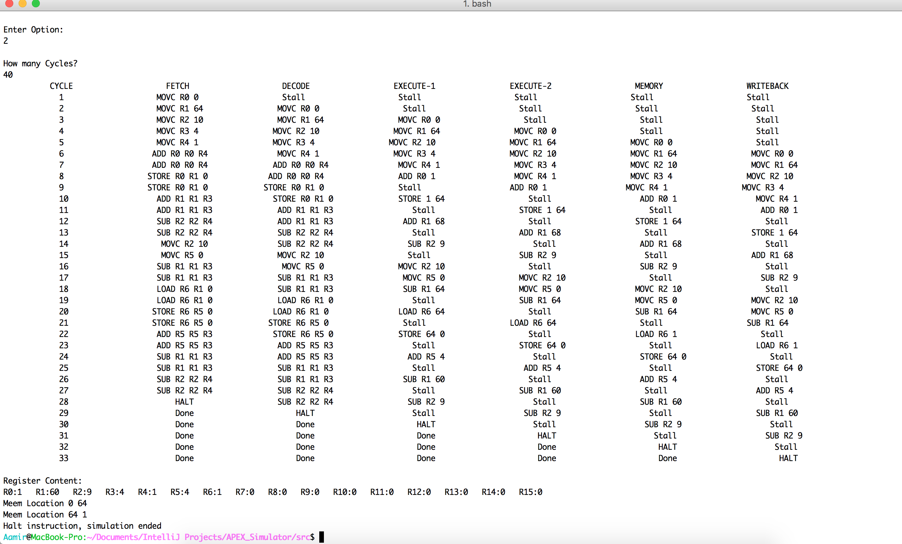

# Implement "A 5 Stage Simple Processor Pipeline" in Java.
>Author: Aamir Yousuf.
>E-mail: ayousuf2@binghamton.edu
>Github: [iamongit](https://github.com/iamongit)

# Stack:
  - Java

# Design:
- Driver.java:
    It is the main class and all the Simulator functions are invoked here
    Displays a menu with options to initialize the simulator, simulate the simulator,     display contents of registers, used memory locations and also the stages of the       pipeline.

- Simulator.java:
    It contains most of the functionality of simulator.
    init() initializes the simulator, reads the input file and creates an arraylist of     instructions. Also sets all the flags, registers and variables used in simulation.

- simulate() executes the various stages of the pipeline starting from the final stage     in a reverse order in order to create the flow of instructions. It contains           doFetch() which fetches the instruction from list and increases the program           counter by 1 after every fetch. Also checks for halt flags , invalid program          counter and maintains a last fetched instruction variable.

- doDecode() decodes instructions based on number of ops, checks dependency on            instructions, sets invalid flags for registers to aid stalling.

- doExecute() happens in two stages, in one stage the ALU operations take place, in       another stage forwarding is maintained for instructions except LOAD and STORE.

- In doExecute2() validity flags of instructions are reset.

- doMemory() carries out all the memory operations of LOAD STORE and resets the           validity flags of registers.

- doWriteback() writes back values into regsiters.

#### All the methods have Javadoc style comments and descriptions.

# How to run:
- In src directory either type:
 javac *.java (followed by) 
java Driver inputFilename.text (name can by anything). 
Follow the simulator menu after that.
- Or do make all followed by java Driver inputFilename.text.

- Have included a sampele input file without branching, produces correct results in registers and memory locations including the necessary stalls in pipeline.
Also providing the screenshot of the results.

    
# Screenshot:

